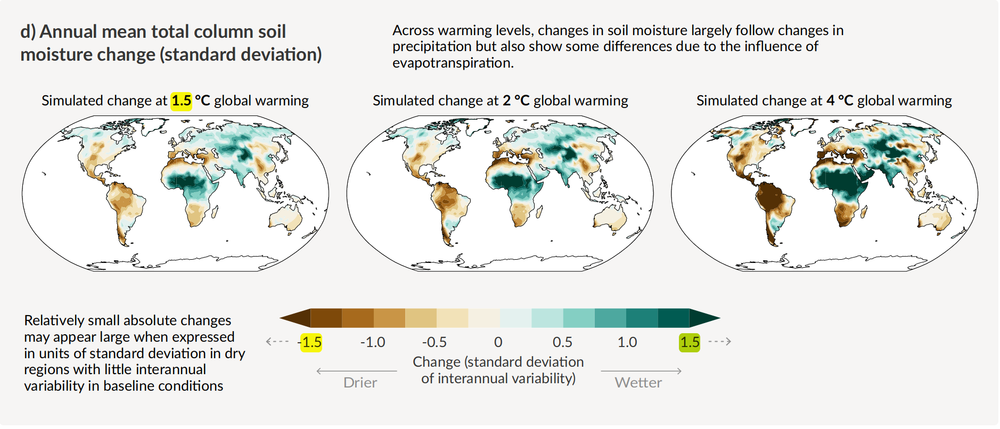
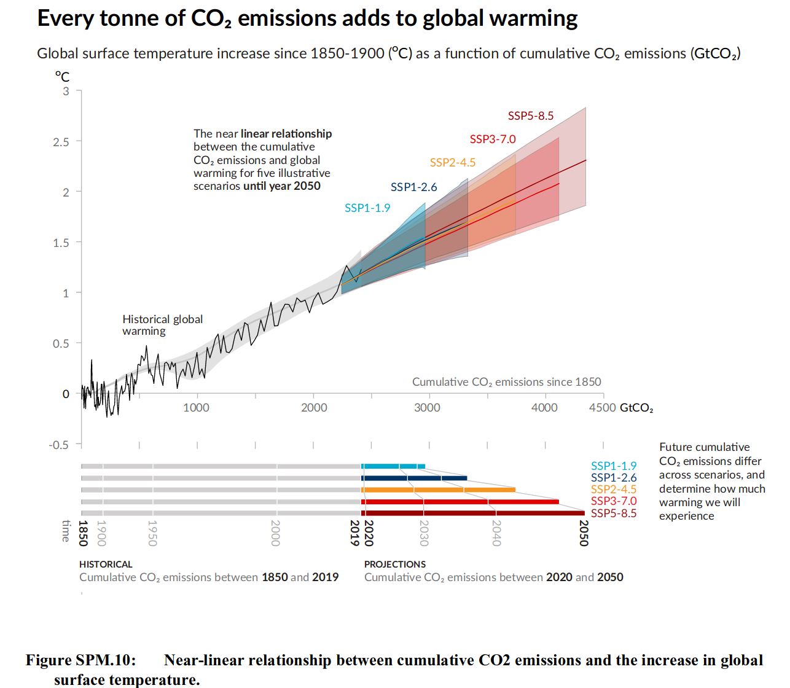
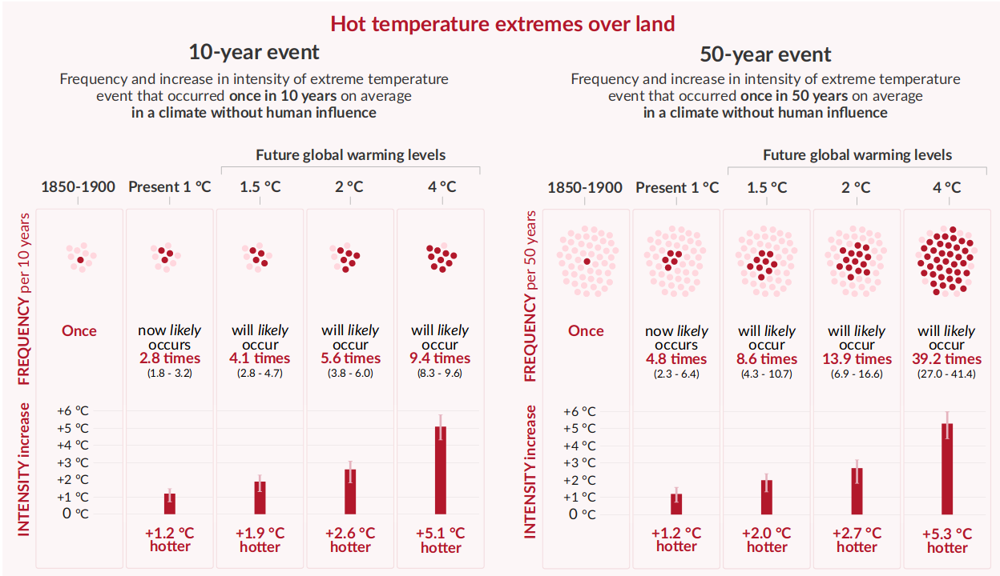

## Warum ist 1,5° eine wichtige Schwelle?

## AR6 zum 1,5°-Ziel

Verweise auf den 1.5 Grad-Report

Wir haben an Land dieses Ziel bereits überschritten: 

> Each of the last four decades has been successively warmer than any decade that preceded it since 1850. Global surface temperature8 in the first two decades of the 21st century (2001-2020) was 0.99 [0.841.10] °C higher than 1850-19009. Global surface temperature was 1.09 [0.95 to 1.20] °C higher in 20112020 than 1850–1900, with larger increases over land (1.59 [1.34 to 1.83] °C) than over the ocean (0.88 [0.68 to 1.01] °C). The estimated increase in global surface temperature since AR5 is principally due to further warming since 2003–2012 (+0.19 [0.16 to 0.22] °C). Additionally, methodological advances and new datasets contributed approximately 0.1ºC to the updated estimate of warming in AR610. [@ipccSummaryPolicymakers2021, p.5]

Visualisierung der bisherigen Entwicklung:

Slide 6 von @SBSTANovember20212021 

Original: https://commons.wikimedia.org/wiki/File:IPCC_AR6_WGI_SPM_obr1.svg

Unterschiedliche Faktoren sind für den Strahlungsantrieb verantwortlich, vor allem CO2:

Fig SPM 2. @AR6WGIbasicslidedeck2021

Man muss 6500, aber eher 125.000 Jahre zurückgehen, um in der Erdgeschichte die aktuellen Temperaturen wiederzufinden.

> Global surface temperature has increased faster since 1970 than in any other 50-year period over at least the last 2000 years (high confidence). Temperatures during the most recent decade (2011–2020) exceed those of the most recent multi-century warm period, around 6500 years ago13 [0.2°C to 1°C relative to 18501900] (medium confidence). Prior to that, the next most recent warm period was about 125,000 years ago when the multi-century temperature [0.5°C to 1.5°C relative to 1850–1900] overlaps the observations of the most recent decade (medium confidence). [@ipccSummaryPolicymakers2021, p.9]

Es ist sehr wahrscheinlich, dass nicht nur 1,5, sondern auch 2° bis zum Ende des Jahrhunderts überschritten werden:

> Global surface temperature will continue to increase until at least the mid-century under all emissions scenarios considered. Global warming of 1.5°C and 2°C will be exceeded during the 21st century unless deep reductions in CO2 and other greenhouse gas emissions occur in the coming decades. [@ipccSummaryPolicymakers2021, p.17]

> Compared to 1850–1900, global surface temperature averaged over 2081–2100 is very likely to be higher by 1.0°C to 1.8°C under the very low GHG emissions scenario considered (SSP1-1.9), by 2.1°C to 3.5°C in the intermediate scenario (SSP2-4.5) and by 3.3°C to 5.7°C under the very high GHG emissions scenario (SSP5-8.5)24. The last time global surface temperature was sustained at or above 2.5°C higher than 1850–1900 was over 3 million years ago (medium confidence).  [@ipccSummaryPolicymakers2021, p.17]

Wie die Tabelle oben auf S.18 zeigt, werden wir mit großer Wahrscheinlichkeit die 1,5° spätestens 2040 erreicht haben, und bei fast allen Szenarios außer dem niedrigsten bis 2100 deutlich übertreffen. [@ipccSummaryPolicymakers2021, p.18]

> Global warming of 1.5°C relative to 1850-1900 would be exceeded during the 21st century under the intermediate, high and very high scenarios considered in this report (SSP2-4.5, SSP3-7.0 and SSP5-8.5, respectively). Under the five illustrative scenarios, in the near term (2021-2040), the 1.5°C global warming level is very likely to be exceeded under the very high GHG emissions scenario (SSP5-8.5), likely to be exceeded under the intermediate and high GHG emissions scenarios (SSP2-4.5 and SSP3-7.0), more likely than not to be exceeded under the low GHG emissions scenario (SSP1-2.6) and more likely than not to be reached under the very low GHG emissions scenario (SSP1-1.9)27. Furthermore, for the very low GHG emissions scenario (SSP1-1.9), it is more likely than not that global surface temperature would decline back to below 1.5°C toward the end of the 21st century, with a temporary overshoot of no more than 0.1°C above 1.5°C global warming.  [@ipccSummaryPolicymakers2021, p.18]

Eine fast sicher Folge werden so noch nie dagewesene Extremereignisse sein.

> There will be an increasing occurrence of some extreme events unprecedented in the observational record with additional global warming, even at 1.5°C of global warming. Projected percentage changes in frequency are higher for rarer events (high confidence). [@ipccSummaryPolicymakers2021, p.19]

In vielen Gebieten werden die Temperaturen deutlich höher sein, am meisten in der Arktis (Fig. SPM 5)

Schon bei 1,5 Grad nehmen Niederschläge regional um 20, 30 und mehr Prozent zu, und die Bodenfeuchtigkeit kann um das Anderhalbfache zu- oder abnehmen. (Fig. SPM 5., c) und d) )

Wie heiss es wird, hängt von den Gesamtemissionen ab, nicht vom aktuellen Ausstoss.

Welche kumulativen Emissionen entsprechen 0,1°

Das für

 1,5° zur Verfügung stehende CO2-Budget liegt bei etwa 400 Gigatonnen, gerechnet ab 2020 (siehe Tabelle 2, p.38)
 
 
 
 
 
 
 

Siehe zur Erläuterung u.a. 

WGI

[@hensonKeyTakeawaysNew2021]

Extremereignisse werden zunehmen (siehe Figure SPM6). 

Sie werden häufiger, und sie werden auch intensiver. 

Zunehmen werden auch die *compound events*, die sich bei 2° dramatisch steigern würden. 

Welche kumulativen Emissionen entsprechen 0,1° (siehe p. 36)

—

> Considering all five illustrative scenarios assessed by WGI, there is at least a greater than 50% likelihood that global warming will reach or exceed 1.5°C in the near‐term, even for the very low greenhouse gas emissions scenario2. [@ipccSummaryPolicyMakers2022, p.7]

> Risks are projected for the near-term (2021-2040), the mid (2041-2060) and long term (2081-2100), at different global warming levels and for pathways that overshoot 1.5°C global warming level for multiple decades27. [@ipccSummaryPolicyMakers2022, p.7]

> SPM.B.3 Global warming, reaching 1.5°C in the near-term, would cause unavoidable increases in multiple climate hazards and present multiple risks to ecosystems and humans (very high confidence). The level of risk will depend on concurrent near-term trends in vulnerability, exposure, level of socioeconomic development and adaptation (high confidence). Near-term actions that limit global warming to close to 1.5°C would substantially reduce projected losses and damages related to climate change in human systems and ecosystems, compared to higher warming levels, but cannot eliminate them all (very high confidence). [@ipccSummaryPolicyMakers2022, p.13]

Die Risiken bestehen für einzigartige und bedrohte Systeme. Sehr hoch ist außerdem das Risiko durch Extremwetter-Ereignisse. Von einem sehr hohen Risiko spricht der IPCC auch für alle Gegenden der Welt, die der Erhitzung besonders ausgesetzt sind und ihr nur wenig angepasst sind. Dabei beziehen sich diese Angaben auf einen Median-Wert von 1,5 Grad. Die Risiken schon bei 1,5° werden im AR6 als wesentlich höher eingeschätzt als noch im AR5 (zwischen beiden liegt der Special Report zu 1,5°).

> SPM.B.3.3 Levels of risk for all Reasons for Concern (RFC) are assessed to become high to very high at lower global warming levels than in AR5 (high confidence). Between 1.2°C and 4.5°C global warming level very high risks emerge in all five RFCs compared to just two RFCs in AR5 (high confidence). Two of these transitions from high to very high risk are associated with near-term warming: risks to unique and threatened systems at a median value of 1.5°C [1.2 to 2.0] °C (high confidence) and risks associated with extreme weather events at a median value of 2°C [1.8 to 2.5] °C (medium confidence). Some key risks contributing to the RFCs are projected to lead to widespread, pervasive, and potentially irreversible impacts at global warming levels of 1.5–2°C if exposure and vulnerability are high and adaptation is low (medium confidence). Near-term actions that limit global warming to close to 1.5°C would substantially reduce projected losses and damages related to climate change in human systems and ecosystems, compared to higher warming levels, but cannot eliminate them all (very high confidence).  [@ipccSummaryPolicyMakers2022, p.13]

Die Risiken für die Biodiversität sind schon bei 1,5° hoch und steigen rasch weiter an, wenn diese Temperatur überschritten wird.

> Biodiversity loss, and degradation, damages to and transformation of ecosystems are already key risks for every region due to past global warming and will continue to escalate with every increment of global warming (very high confidence). In terrestrial ecosystems, 3 to 14% of species assessed33 will likely face very high risk of extinction34 at global warming levels of 1.5°C, increasing up to 3 to 18% at 2°C, 3 to 29% at 3°C, 3 to 39% at 4°C, and 3 to 48% at 5°C. In ocean and coastal ecosystems, risk of biodiversity loss ranges between moderate and very high by 1.5°C global warming level and is moderate to very high by 2°C but with more ecosystems at high and very high risk (high confidence), and increases to high to very high across most ocean and coastal ecosystems by 3°C (medium to high confidence, depending on ecosystem). Very high extinction risk for endemic species in biodiversity hotspots is projected to at least double from 2% between 1.5°C and 2°C global warming levels and to increase at least tenfold if warming rises from 1.5°C to 3°C (medium confidence).  [@ipccSummaryPolicyMakers2022, p.14]

Direkte Fluschäden könnten sich verdoppeln, wenn Erhitzung 2° beträgt. 

> Projected increases in direct flood damages are higher by 1.4 to 2 times at 2°C and 2.5 to 3.9 times at 3°C compared to 1.5°C global warming without adaptation (medium confidence).  [@ipccSummaryPolicyMakers2022, p.14]

Die Risiken für die Lebensmittelversorgung steigern sich von maßvoll zu *hoch*, wenn sich die Erhitzung bis zu 2° fortsetzt:

> Increases in frequency, intensity and severity of droughts, floods and heatwaves, and continued sea level rise will increase risks to food security (high confidence) in vulnerable regions from moderate to high between 1.5°C and 2°C global warming level, with no or low levels of adaptation (medium confidence). At 2°C or higher global warming level in the mid-term, food security risks due to climate change will be more severe, leading to malnutrition and micro-nutrient deficiencies, concentrated in Sub-Saharan Africa, South Asia, Central and South America and Small Islands (high confidence). [@ipccSummaryPolicyMakers2022, p.14]

> Above 1.5°C global warming increasing concurrent climate extremes will increase risk of simultaneous crop losses of maize in major food-producing regions, with this risk increasing further with higher global warming levels (medium confidence). [@ipccSummaryPolicyMakers2022, p.19]

1,5° nur zeitweise zu überschreiten führt einerseits zu irreversiblen Schäden und andererseits dazu, dass weitere Treibhausgase freigesetzt werden können.

> SPM.B.6 If global warming transiently exceeds 1.5°C in the coming decades or later (overshoot)37, then many human and natural systems will face additional severe risks, compared to remaining below 1.5°C (high confidence). Depending on the magnitude and duration of overshoot, some impacts will cause release of additional greenhouse gases (medium confidence) and some will be irreversible, even if global warming is reduced (high confidence).  [@ipccSummaryPolicyMakers2022, p.20]

Im IPCC-Bericht wird betont, dass es schwierig ist, die Folgen einer Überschreitung dieser Grenze zu modellieren, dass man aber zuverlässige Aussagen über irreversible Folgen treffen kann.  [@ipccSummaryPolicyMakers2022, p.20]

Abbildung 4 der Summary for Policy Makers des zweiten Teils ist eine komplexe Zusammenstellung von Informationen über mögliche Anpassungsmaßnahmen an Temperatursteigerungen bis zur 1,5°-Grenze. Dabei wird einerseits bewertet, wie gut sie umsetzbar sind und ob sie auch zum Klimaschutz beitragen. Andererseits wird eingeschätzt, ob und wieviele Synergien zu den Nachhaltigen Entwicklunszielen der Vereinten Nationen bestehen. 

 

Erhaltungs und Schutzmaßnahmen müssen sich an die Veränderungen durch die Erhitzung anpassen, insbesondere, wenn man dern1,5° nahekommt  [@ipccSummaryPolicyMakers2022, p.24].

> To be effective, conservation and restoration actions will increasingly need to be responsive, as appropriate, to ongoing changes at various scales, and plan for future changes in ecosystem structure, community composition and species’ distributions, especially as 1.5°C global warming is approached and even more so if it is exceeded (high confidence).

## Bedeutung von 1,5° für Österreich und Graz 

Es gibt einerseits folgen und Risiken aufgrund der besonderen Gegebenheiten in Graz bzw. Österreich und andererseits als Folgen von globalen Risiken und Risiken an anderen Stellen des Planeten. Abhängigkeiten vergößern dabei Risiken oft. 
