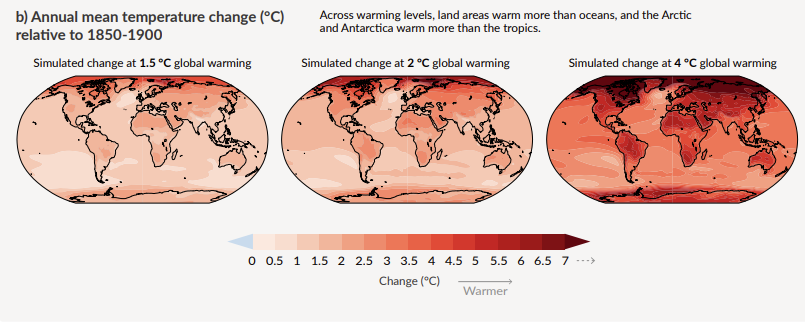
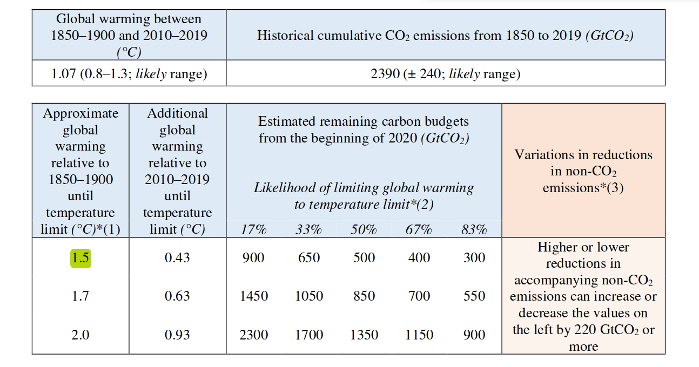
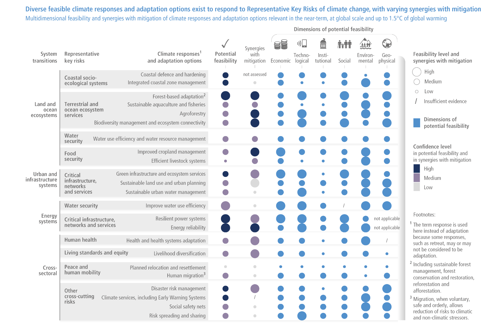
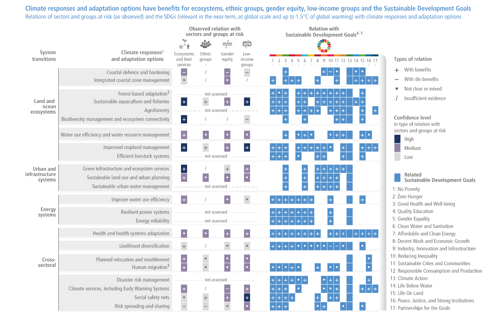
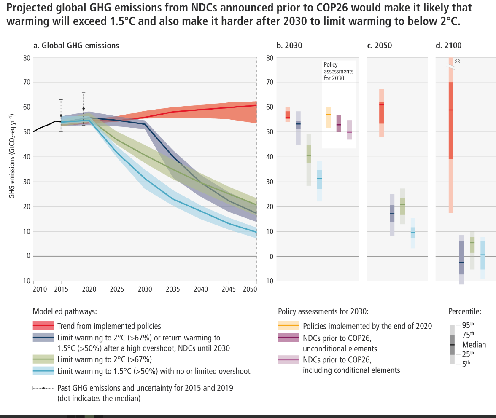

## Warum ist 1,5° eine wichtige Schwelle?

Die 1,5° zu 

## AR6 zum 1,5°-Ziel

Verweise auf den 1.5 Grad-Report

Wir haben an Land dieses Ziel bereits überschritten: 

> Each of the last four decades has been successively warmer than any decade that preceded it since 1850. Global surface temperature8 in the first two decades of the 21st century (2001-2020) was 0.99 [0.841.10] °C higher than 1850-19009. Global surface temperature was 1.09 [0.95 to 1.20] °C higher in 20112020 than 1850–1900, with larger increases over land (1.59 [1.34 to 1.83] °C) than over the ocean (0.88 [0.68 to 1.01] °C). The estimated increase in global surface temperature since AR5 is principally due to further warming since 2003–2012 (+0.19 [0.16 to 0.22] °C). Additionally, methodological advances and new datasets contributed approximately 0.1ºC to the updated estimate of warming in AR610. [@ipccSummaryPolicymakers2021, p.5]

Visualisierung der bisherigen Entwicklung:

Slide 6 von @SBSTANovember20212021 

Original: https://commons.wikimedia.org/wiki/File:IPCC_AR6_WGI_SPM_obr1.svg

Unterschiedliche Faktoren sind für den Strahlungsantrieb verantwortlich, vor allem CO2:

Fig SPM 2. @AR6WGIbasicslidedeck2021

Man muss 6500, aber eher 125.000 Jahre zurückgehen, um in der Erdgeschichte die aktuellen Temperaturen wiederzufinden.

> Global surface temperature has increased faster since 1970 than in any other 50-year period over at least the last 2000 years (high confidence). Temperatures during the most recent decade (2011–2020) exceed those of the most recent multi-century warm period, around 6500 years ago13 [0.2°C to 1°C relative to 18501900] (medium confidence). Prior to that, the next most recent warm period was about 125,000 years ago when the multi-century temperature [0.5°C to 1.5°C relative to 1850–1900] overlaps the observations of the most recent decade (medium confidence). [@ipccSummaryPolicymakers2021, p.9]

Es ist sehr wahrscheinlich, dass nicht nur 1,5, sondern auch 2° bis zum Ende des Jahrhunderts überschritten werden:

> Global surface temperature will continue to increase until at least the mid-century under all emissions scenarios considered. Global warming of 1.5°C and 2°C will be exceeded during the 21st century unless deep reductions in CO2 and other greenhouse gas emissions occur in the coming decades. [@ipccSummaryPolicymakers2021, p.17]

> Compared to 1850–1900, global surface temperature averaged over 2081–2100 is very likely to be higher by 1.0°C to 1.8°C under the very low GHG emissions scenario considered (SSP1-1.9), by 2.1°C to 3.5°C in the intermediate scenario (SSP2-4.5) and by 3.3°C to 5.7°C under the very high GHG emissions scenario (SSP5-8.5)24. The last time global surface temperature was sustained at or above 2.5°C higher than 1850–1900 was over 3 million years ago (medium confidence).  [@ipccSummaryPolicymakers2021, p.17]

Wie die Tabelle oben auf S.18 zeigt, werden wir mit großer Wahrscheinlichkeit die 1,5° spätestens 2040 erreicht haben, und bei fast allen Szenarios außer dem niedrigsten bis 2100 deutlich übertreffen. [@ipccSummaryPolicymakers2021, p.18] Bei keinem dieser Shared Socioeconomic Patways wird 1,5° nicht wenigstens zeitweise überschritten, und es gibt nur einen (und der weit von der ökonomischen Realität entfernt), bei dem gegen Ende des Jahrhunderts die 1,5° wieder unterschritten werden. 

> Global warming of 1.5°C relative to 1850-1900 would be exceeded during the 21st century under the intermediate, high and very high scenarios considered in this report (SSP2-4.5, SSP3-7.0 and SSP5-8.5, respectively). Under the five illustrative scenarios, in the near term (2021-2040), the 1.5°C global warming level is very likely to be exceeded under the very high GHG emissions scenario (SSP5-8.5), likely to be exceeded under the intermediate and high GHG emissions scenarios (SSP2-4.5 and SSP3-7.0), more likely than not to be exceeded under the low GHG emissions scenario (SSP1-2.6) and more likely than not to be reached under the very low GHG emissions scenario (SSP1-1.9)27. Furthermore, for the very low GHG emissions scenario (SSP1-1.9), it is more likely than not that global surface temperature would decline back to below 1.5°C toward the end of the 21st century, with a temporary overshoot of no more than 0.1°C above 1.5°C global warming.  [@ipccSummaryPolicymakers2021, p.18]

Eine fast sicher Folge werden so noch nie dagewesene Extremereignisse sein.

> There will be an increasing occurrence of some extreme events unprecedented in the observational record with additional global warming, even at 1.5°C of global warming. Projected percentage changes in frequency are higher for rarer events (high confidence). [@ipccSummaryPolicymakers2021, p.19]

In vielen Gebieten werden die Temperaturen deutlich höher sein, am meisten in der Arktis (Fig. SPM 5)

Schon bei 1,5 Grad nehmen Niederschläge regional um 20, 30 und mehr Prozent zu, und die Bodenfeuchtigkeit kann um das Anderhalbfache zu- oder abnehmen. (Fig. SPM 5., c) und d) )

Wie heiss es wird, hängt von den Gesamtemissionen ab, nicht vom aktuellen Ausstoss.

Welche kumulativen Emissionen entsprechen 0,1°

Das für

 1,5° zur Verfügung stehende CO2-Budget liegt bei etwa 400 Gigatonnen, gerechnet ab 2020 (siehe Tabelle 2, p.38)
 
 
 
 
 
 
 

Siehe zur Erläuterung u.a. 

WGI

[@hensonKeyTakeawaysNew2021]

Extremereignisse werden zunehmen (siehe Figure SPM6). 

Sie werden häufiger, und sie werden auch intensiver. 

Zunehmen werden auch die *compound events*, die sich bei 2° dramatisch steigern würden. 

Welche kumulativen Emissionen entsprechen 0,1° (siehe p. 36)

—

> Considering all five illustrative scenarios assessed by WGI, there is at least a greater than 50% likelihood that global warming will reach or exceed 1.5°C in the near‐term, even for the very low greenhouse gas emissions scenario2. [@ipccSummaryPolicyMakers2022, p.7]

> Risks are projected for the near-term (2021-2040), the mid (2041-2060) and long term (2081-2100), at different global warming levels and for pathways that overshoot 1.5°C global warming level for multiple decades27. [@ipccSummaryPolicyMakers2022, p.7]

> SPM.B.3 Global warming, reaching 1.5°C in the near-term, would cause unavoidable increases in multiple climate hazards and present multiple risks to ecosystems and humans (very high confidence). The level of risk will depend on concurrent near-term trends in vulnerability, exposure, level of socioeconomic development and adaptation (high confidence). Near-term actions that limit global warming to close to 1.5°C would substantially reduce projected losses and damages related to climate change in human systems and ecosystems, compared to higher warming levels, but cannot eliminate them all (very high confidence). [@ipccSummaryPolicyMakers2022, p.13]

Die Risiken bestehen für einzigartige und bedrohte Systeme. Sehr hoch ist außerdem das Risiko durch Extremwetter-Ereignisse. Von einem sehr hohen Risiko spricht der IPCC auch für alle Gegenden der Welt, die der Erhitzung besonders ausgesetzt sind und ihr nur wenig angepasst sind. Dabei beziehen sich diese Angaben auf einen Median-Wert von 1,5 Grad. Die Risiken schon bei 1,5° werden im AR6 als wesentlich höher eingeschätzt als noch im AR5 (zwischen beiden liegt der Special Report zu 1,5°).

> SPM.B.3.3 Levels of risk for all Reasons for Concern (RFC) are assessed to become high to very high at lower global warming levels than in AR5 (high confidence). Between 1.2°C and 4.5°C global warming level very high risks emerge in all five RFCs compared to just two RFCs in AR5 (high confidence). Two of these transitions from high to very high risk are associated with near-term warming: risks to unique and threatened systems at a median value of 1.5°C [1.2 to 2.0] °C (high confidence) and risks associated with extreme weather events at a median value of 2°C [1.8 to 2.5] °C (medium confidence). Some key risks contributing to the RFCs are projected to lead to widespread, pervasive, and potentially irreversible impacts at global warming levels of 1.5–2°C if exposure and vulnerability are high and adaptation is low (medium confidence). Near-term actions that limit global warming to close to 1.5°C would substantially reduce projected losses and damages related to climate change in human systems and ecosystems, compared to higher warming levels, but cannot eliminate them all (very high confidence).  [@ipccSummaryPolicyMakers2022, p.13]

Die Risiken für die Biodiversität sind schon bei 1,5° hoch und steigen rasch weiter an, wenn diese Temperatur überschritten wird.

> Biodiversity loss, and degradation, damages to and transformation of ecosystems are already key risks for every region due to past global warming and will continue to escalate with every increment of global warming (very high confidence). In terrestrial ecosystems, 3 to 14% of species assessed33 will likely face very high risk of extinction34 at global warming levels of 1.5°C, increasing up to 3 to 18% at 2°C, 3 to 29% at 3°C, 3 to 39% at 4°C, and 3 to 48% at 5°C. In ocean and coastal ecosystems, risk of biodiversity loss ranges between moderate and very high by 1.5°C global warming level and is moderate to very high by 2°C but with more ecosystems at high and very high risk (high confidence), and increases to high to very high across most ocean and coastal ecosystems by 3°C (medium to high confidence, depending on ecosystem). Very high extinction risk for endemic species in biodiversity hotspots is projected to at least double from 2% between 1.5°C and 2°C global warming levels and to increase at least tenfold if warming rises from 1.5°C to 3°C (medium confidence).  [@ipccSummaryPolicyMakers2022, p.14]

Direkte Fluschäden könnten sich verdoppeln, wenn Erhitzung 2° beträgt. 

> Projected increases in direct flood damages are higher by 1.4 to 2 times at 2°C and 2.5 to 3.9 times at 3°C compared to 1.5°C global warming without adaptation (medium confidence).  [@ipccSummaryPolicyMakers2022, p.14]

Die Risiken für die Lebensmittelversorgung steigern sich von maßvoll zu *hoch*, wenn sich die Erhitzung bis zu 2° fortsetzt:

> Increases in frequency, intensity and severity of droughts, floods and heatwaves, and continued sea level rise will increase risks to food security (high confidence) in vulnerable regions from moderate to high between 1.5°C and 2°C global warming level, with no or low levels of adaptation (medium confidence). At 2°C or higher global warming level in the mid-term, food security risks due to climate change will be more severe, leading to malnutrition and micro-nutrient deficiencies, concentrated in Sub-Saharan Africa, South Asia, Central and South America and Small Islands (high confidence). [@ipccSummaryPolicyMakers2022, p.14]

> Above 1.5°C global warming increasing concurrent climate extremes will increase risk of simultaneous crop losses of maize in major food-producing regions, with this risk increasing further with higher global warming levels (medium confidence). [@ipccSummaryPolicyMakers2022, p.19]

1,5° nur zeitweise zu überschreiten führt einerseits zu irreversiblen Schäden und andererseits dazu, dass weitere Treibhausgase freigesetzt werden können.

> SPM.B.6 If global warming transiently exceeds 1.5°C in the coming decades or later (overshoot)37, then many human and natural systems will face additional severe risks, compared to remaining below 1.5°C (high confidence). Depending on the magnitude and duration of overshoot, some impacts will cause release of additional greenhouse gases (medium confidence) and some will be irreversible, even if global warming is reduced (high confidence).  [@ipccSummaryPolicyMakers2022, p.20]

Im IPCC-Bericht wird betont, dass es schwierig ist, die Folgen einer Überschreitung dieser Grenze zu modellieren, dass man aber zuverlässige Aussagen über irreversible Folgen treffen kann.  [@ipccSummaryPolicyMakers2022, p.20]

Abbildung 4 der Summary for Policy Makers des zweiten Teils ist eine komplexe Zusammenstellung von Informationen über mögliche Anpassungsmaßnahmen an Temperatursteigerungen bis zur 1,5°-Grenze. Dabei wird einerseits bewertet, wie gut sie umsetzbar sind und ob sie auch zum Klimaschutz beitragen. Andererseits wird eingeschätzt, ob und wieviele Synergien zu den Nachhaltigen Entwicklunszielen der Vereinten Nationen bestehen. 

 

Erhaltungs und Schutzmaßnahmen müssen sich an die Veränderungen durch die Erhitzung anpassen, insbesondere, wenn man dern1,5° nahekommt  [@ipccSummaryPolicyMakers2022, p.24].

> To be effective, conservation and restoration actions will increasingly need to be responsive, as appropriate, to ongoing changes at various scales, and plan for future changes in ecosystem structure, community composition and species’ distributions, especially as 1.5°C global warming is approached and even more so if it is exceeded (high confidence).

> Adaptations for hydropower and thermo-electric power generation are effective in most regions up to 1.5°C to 2°C, with decreasing effectiveness at higher levels of warming (medium confidence). Climate responsive energy markets, updated design standards on energy assets according to current and projected climate change, smart-grid technologies, robust transmission systems and improved capacity to respond to supply deficits have high feasibility in the medium- to long-term, with mitigation co-benefits (very high confidence).  [@ipccSummaryPolicyMakers2022, p.26].

> Above 1.5°C global warming level, some ecosystem-based adaptation measures will lose their effectiveness in providing benefits to people as these ecosystems will reach hard adaptation limits (high confidence). {1.4, 2.4, 2.6, 3.4, 3.6, CCB SLR, 9.6, Box11.2, 13.4, 14.5, 15.5, 16.4, 16.6, 17.2, CCP1.2, CCP5.2, CCP6.3, CCP7.3, Figure SPM.4}  [@ipccSummaryPolicyMakers2022, p.27]

> Above 1.5°C global warming level, limited freshwater resources pose potential hard limits for Small Islands and for regions dependent on glacier and snow-melt (medium confidence). By 2°C global warming level, soft limits are projected for multiple staple crops in many growing areas, particularly in tropical regions (high confidence). By 3°C global warming level, soft limits are projected for some water management measures for many regions, with hard limits projected for parts of Europe (medium confidence). Transitioning from incremental to transformational adaptation can help overcome soft adaptation limits (high confidence).. [@ipccSummaryPolicyMakers2022, p.27] 

> There is a rapidly narrowing window of opportunity to enable climate resilient development. Multiple climate resilient development pathways are still possible by which communities, the private sector, governments, nations and the world can pursue climate resilient development – each involving and resulting from different societal choices influenced by different contexts and opportunities and constraints on system transitions. Climate resilient development pathways are progressively constrained by every increment of warming, in particular beyond 1.5°C, social and economic inequalities, the balance between adaptation and mitigation varying by national, regional and local circumstances and geographies, according to capabilities including resources, vulnerability, culture and values, past development choices leading to past emissions and future warming scenarios, bounding the climate resilient development pathways remaining, and the ways in which development trajectories are shaped by equity, and social and climate justice. (very high confidence)  [@ipccSummaryPolicyMakers2022, p.30]

> Climate resilient development is progressively harder to achieve with global warming levels beyond 1.5°C. Inadequate progress towards the Sustainable Development Goals (SDGs) by 2030 reduces climate resilient development prospects. There is a narrowing window of opportunity to shift pathways towards more climate resilient development futures as reflected by the adaptation limits and increasing climate risks, considering the remaining carbon budgets.  [@ipccSummaryPolicyMakers2022, p.32]

> Biodiversity and ecosystem services have limited capacity to adapt to increasing global warming levels, which will make climate resilient development progressively harder to achieve beyond 1.5°C warming (very high confidence). Consequences of current and future global warming for climate resilient development include reduced effectiveness of EbA and approaches to climate change mitigation based on ecosystems and amplifying feedbacks to the climate system (high confidence)  [@ipccSummaryPolicyMakers2022, p.34] 

> SPM.D.5 It is unequivocal that climate change has already disrupted human and natural systems. Past and current development trends (past emissions, development and climate change) have not advanced global climate resilient development (very high confidence). Societal choices and actions implemented in the next decade determine the extent to which medium- and long-term pathways will deliver higher or lower climate resilient development (high confidence). Importantly climate resilient development prospects are increasingly limited if current greenhouse gas emissions do not rapidly decline, especially if 1.5°C global warming is exceeded in the near term (high confidence). These prospects are constrained by past development, emissions and climate change, and enabled by inclusive governance, adequate and appropriate human and technological resources, information, capacities and finance (high confidence). [@ipccSummaryPolicyMakers2022, p.35]

> SPM.D.5.1 Climate resilient development is already challenging at current global warming levels (high confidence). The prospects for climate resilient development will be further limited if global warming levels exceeds 1.5°C (high confidence) and not be possible in some regions and sub-regions if the global warming level exceeds 2°C (medium confidence). Climate resilient development is most constrained in regions/subregions in which climate impacts and risks are already advanced, including low-lying coastal cities and settlements, small islands, deserts, mountains and polar regions (high confidence [@ipccSummaryPolicyMakers2022, p.35]

Zu den historischen Emissionen (WGIII)

> Historical cumulative net CO2 emissions from 1850 to 2019 were 2400±240 GtCO2 (high confidence). Of these, more than half (58%) occurred between 1850 and 1989 [1400±195 GtCO2], and about 42% between 1990 and 2019 [1000±90 GtCO2]. About 17% of historical cumulative net CO2 emissions since 1850 occurred between 2010 and 2019 [410±30 GtCO2]. [FOOTNOTE 10] By comparison, the current central estimate of the remaining carbon budget from 2020 onwards for limiting warming to 1.5°C with a probability of 50% has been assessed as 500 Gt CO2, and as 1150 Gt CO2 for a probability of 67% for limiting warming to 2°C. Remaining carbon budgets depend on the amount of non-CO2 mitigation (±220 Gt CO2) and are further subject to geophysical uncertainties. [@ipccSummaryPolicymakers2022, p.5] 

Zur Frage des Decoupling

Unabhängig davon, ob es grundsätzlich möglich ist, Wachstum und Treibhausgasemissionen zu entkoppeln: Das 1.5°-Ziel ist ohne Degrowth unerreichbar:

> Global energy intensity (total primary energy per unit GDP) decreased by 2% yr-1 between 2010 and 2019. Carbon intensity (CO2 from fossil fuel combustion and industrial processes (CO2 FFI) per unit primary energy) decreased by 0.3% yr-1, with large regional variations, over the same period mainly due to fuel switching from coal to gas, reduced expansion of coal capacity, and increased use of renewables. This reversed the trend observed for 2000–2009. For comparison, the carbon intensity of primary energy is projected to decrease globally by about 3.5% yr-1 between 2020 and 2050 in modelled scenarios that limit warming to 2°C (>67%), and by about 7.7% yr-1 globally in scenarios that limit warming to 1.5°C (>50%) with no or limited overshoot.16 (high confidence) {Figure 2.16, 2.2, 2.4, Table 3.4, 3.4, 6.3}  [@ipccSummaryPolicymakers2022, p.8]

Die Selbstverpflichtungen (NDCs) und noch mehr die policies der Staaten führen eindeutig zu einer Überschreitung der 1,5°-Linie.

> Global GHG emissions in 2030 associated with the implementation of nationally determined contributions (NDCs) announced prior to COP26 [FOOTNOTE 24] would make it likely that warming will exceed 1.5°C during the 21st century.[FOOTNOTE 25] Likely limiting warming to below 2°C would then rely on a rapid acceleration of mitigation efforts after 2030. Policies implemented by the end of 2020 [FOOTNOTE 26] are projected to result in higher global GHG emissions than those implied by NDCs. (high confidence) [@ipccSummaryPolicymakers2022, p.15] 

Eine entscheidende Aussage ist in einer Fussnote verborgen.

> FOOTNOTE 25: This implies that mitigation after 2030 can no longer establish a pathway with less than 67% probability to exceed 1.5°C during the 21st century, a defining feature of the class of pathways that limit warming to 1.5°C (>50%) with no or limited overshoot assessed in this report (Category C1 in Table SPM.1). These pathways limit warming to 1.6°C or lower throughout the 21st century with a 50% likelihood. [@ipccSummaryPolicymakers2022, p.15] 

Die Tabelle X zeigt, wie weit die NDCs vom 1,5°-Ziel entfernt sind:

> FOOTNOTE 27: Immediate action in modelled global pathways refers to the adoption between 2020 and at latest before 2025 of climate policies intended to limit global warming to a given level. Modelled pathways that limit warming to 2°C (>67%) based on immediate action are summarised in Category C3a in Table SPM.1. All assessed modelled global pathways that limit warming to 1.5°C (>50%)  [@ipccSummaryPolicymakers2022, p.15-16]

Negative Emissionen

> B.6.4 Modelled global emission pathways consistent with NDCs announced prior to COP26 will likely exceed 1.5°C during the 21st century. Those pathways that then return warming to 1.5°C by 2100 with a likelihood of 50% or greater imply a temperature overshoot of 0.15-0.3°C (42 pathways in category C2 in Table SPM.1). In such pathways, global cumulative net-negative CO2 emissions are 380 [-860 to -200] GtCO2 [FOOTNOTE 31] in the second half of the century, and there is a rapid acceleration of other mitigation efforts across all sectors after 2030. Such overshoot pathways imply increased climate-related risk, and are subject to increased feasibility concerns[FOOTNOTE 32], and greater social and environmental risks, compared to pathways that limit warming to 1.5°C (>50%) with no or limited overshoot. (high confidence) (Figure SPM.4, Table SPM.1) {3.3, 3.5, 3.8, 12.3; WG II SPM.B.6} [@ipccSummaryPolicymakers2022, p.17]

Die Abbildung 4 von Teil III zeigt, wie groß der Abstand der aktuellen Politik und noch mehr der NDCs vom 1,5° und sogar vom 2°-Ziel ist:

> Projected cumulative future CO2 emissions over the lifetime of existing and currently planned fossil fuel infrastructure without additional abatement exceed the total cumulative net CO2 emissions in pathways that limit warming to 1.5°C (>50%) with no or limited overshoot. They are approximately equal to total cumulative net CO2 emissions in pathways that limit warming to 2°C (>67%). (high confidence) {2.7, 3.3}  [@ipccSummaryPolicymakers2022, p.19]

Ohne eine sofortige Veränderung der Politik mit tatsächlich transformativem Charakter steuern wir auf über 3° zu:

> C.1 Global GHG emissions are projected to peak between 2020 and at the latest before 2025 in global modelled pathways that limit warming to 1.5°C (>50%) with no or limited overshoot and in those that limit warming to 2°C (>67%) and assume immediate action. [ Table SPM footnote [#9], FOOTNOTE 38] In both types of modelled pathways, rapid and deep GHG emissions reductions follow throughout 2030, 2040 and 2050 (high confidence). Without a strengthening of policies beyond those that are implemented by the end of 2020, GHG emissions are projected to rise beyond 2025, leading to a median global warming of 3.2 [2.2 to 3.5] °C by 2100 [FOOTNOTE 39, 40] (medium confidence). (Table SPM.1, Figure SPM.4, Figure SPM.5) {3.3, 3.4}  [@ipccSummaryPolicymakers2022, p.21]

Welche Reduktionen sind notwendig?

> In pathways that limit warming to 1.5°C (>50%) with no or limited overshoot global net CO2 emissions are reduced compared to modelled 2019 emissions by 48% [36–69%] in 2030 and by 80% [61-109%] in 2040; and global CH4 emissions are reduced by 34% [21–57%] in 2030 and 44% [31-63%] in 2040. There are similar reductions of non-CO2 emissions by 2050 in both types of pathways:  [@ipccSummaryPolicymakers2022, p.22]

Die Kategorien der Szenarios in Teil 3 werden in Bezug auf das 1,5°-Ziel definiert, z.B.:

> Category C1 comprises modelled scenarios that limit warming to 1.5°C in 2100 with a likelihood of greater than 50%, and reach or exceed warming of 1.5°C during the 21st century with a likelihood of 67% or less. In this report, these scenarios are referred to as scenarios that limit warming to 1.5°C (>50%) with no or limited overshoot. Limited overshoot refers to exceeding 1.5°C global warming by up to about 0.1°C and for up to several decades. [FOOTNOTE 49] [@ipccSummaryPolicymakers2022, p.27]

Wenn Net zero erreicht wird (ohne selbstlaufende Erwärmungen auszulösen), dann hört die Erwärmung auch tatsächlich auf. Für das 1,5°-Ziel muss das global (nicht nur bei uns) 2050 erreicht sein.

> C.2 Global net zero CO2 emissions are reached in the early 2050s in modelled pathways that limit warming to 1.5°C (>50%) with no or limited overshoot, and around the early 2070s in modelled pathways that limit warming to 2°C (>67%). Many of these pathways continue to net negative CO2 emissions after the point of net zero. These pathways also include deep reductions in other GHG emissions. The level of peak warming depends on cumulative CO2 emissions until the time of net zero CO2 and the change in non-CO2 climate forcers by the time of peaking. Deep GHG emissions reductions by 2030 and 2040, particularly reductions of methane emissions, lower peak warming, reduce the likelihood of overshooting warming limits and lead to less reliance on net negative CO2 emissions that reverse warming in the latter half of the century. Reaching and sustaining global net zero GHG emissions results in a gradual decline in warming. (high confidenc  [@ipccSummaryPolicymakers2022, p.30-31]

> Modelled global pathways limiting warming to 1.5°C (>50%) with no or limited overshoot are associated with projected cumulative net CO2 emissions [FOOTNOTE 51] until the time of net zero CO2 of 510 [330–710] GtCO2. [@ipccSummaryPolicymakers2022, p.31]

> C.3 All global modelled pathways that limit warming to 1.5°C (>50%) with no or limited overshoot, and those that limit warming to 2°C (>67%) involve rapid and deep and in most cases immediate GHG emission reductions in all sectors. Modelled mitigation strategies to achieve these reductions include transitioning from fossil fuels without CCS to very low- or zero-carbon energy sources, such as renewables or fossil fuels with CCS, demand side measures and improving efficiency, reducing non-CO2 emissions, and deploying carbon dioxide removal (CDR) methods to counterbalance residual GHG emissions. Illustrative Mitigation Pathways (IMPs) show different combinations of sectoral mitigation strategies consistent with a given warming level. (high confidence) (Figure SPM.5) {3.2, 3.3, 3.4, 6.4, 6.6} [@ipccSummaryPolicymakers2022, p.32]

> C.3.5 Methods and levels of CDR deployment in global modelled mitigation pathways vary depending on assumptions about costs, availability and constraints. [FOOTNOTE 54] In modelled pathways that report CDR and that limit warming to 1.5°C (>50%) with no or limited overshoot, global cumulative CDR during 2020-2100 from Bioenergy with Carbon Dioxide Capture and Storage (BECCS) and Direct Air Carbon Dioxide Capture and Storage (DACCS) is 30-780 GtCO2 and 0-310 GtCO2, respectively. In these modelled pathways, the AFOLU sector contributes 20-400 GtCO2 net negative emissions.  [@ipccSummaryPolicymakers2022, p.33]

CCS

> Currently, global rates of CCS deployment are far below those in modelled pathways limiting global warming to 1.5°C or 2°C.  [@ipccSummaryPolicymakers2022, p.37]

Darstellung der möglichen Klimaschutz-Maßnahmen:

> Broadening equitable access to domestic and international finance, technologies that facilitate mitigation, and capacity, while explicitly addressing needs can further integrate equity and justice into national and international policies and act as a catalyst for accelerating mitigation and shifting development pathways (medium confidence). The consideration of ethics and equity can help address the uneven distribution of adverse impacts associated with 1.5°C and higher levels of global warming, in all societies (high confidence). [@ipccSummaryPolicymakers2022, p.56]

Nötige Investionen

> E.5.1 Average annual modelled investment requirements for 2020 to 2030 in scenarios that limit warming to 2°C or 1.5°C are a factor of three to six greater than current levels, and total mitigation investments (public, private, domestic and international) would need to increase across all sectors and regions (medium confidence).  [@ipccSummaryPolicymakers2022, p.61]

## Bedeutung von 1,5° für Österreich und Graz 

Es gibt einerseits folgen und Risiken aufgrund der besonderen Gegebenheiten in Graz bzw. Österreich und andererseits als Folgen von globalen Risiken und Risiken an anderen Stellen des Planeten. Abhängigkeiten vergößern dabei Risiken oft. 
